  

  <strong>AI/ML Engineer building production systems around Generative AI, RAG, Knowledge Graphs, Agentic AI, and Context Intelligence.</strong>

  <a href="#what-i-build">What I Build</a> &middot;
  <a href="#engineering--simpplr">Engineering @ Simpplr</a> &middot;
  <a href="#flagship-projects">Flagship Projects</a> &middot;
  <a href="#toolbox">Toolbox</a> &middot;
  <a href="#experience--education">Experience</a>

  
  
  

---

## About me

  

  I work on the engineering between a good AI demo and a reliable production system — retrieval, graphs, context, memory, safety, evaluation, and failure handling.

---

## What I build

  

<strong>Explore the systems behind the orbit</strong>

 

**Knowledge & Context Systems**
- Knowledge Graph construction
- Entity / identity resolution
- GraphRAG & multi-hop retrieval
- Context & memory architectures
- Temporal and scoped personalization

**Agentic & LLM Systems**
- Multi-agent orchestration
- RAG pipelines & evaluation
- Dynamic guardrails / policies
- LLM routing & inference
- Failure-aware production workflows

---

## Engineering @ Simpplr

  

  I contribute to private enterprise AI systems; this is a public-safe summary of the engineering themes.

<strong>Open engineering highlights</strong>

 

**Knowledge Graph & GraphRAG** — entity canonicalization, person resolution, incremental ingestion, cross-graph ranking, relationship enrichment, and multi-hop retrieval.

**Agent Safety Infrastructure** — tenant-aware guardrails, Redis-backed policy retrieval, agent-specific policy application, and modular prompt-policy composition.

**Memory & Personalization** — scoped memory, reconciliation, authorization, provenance, lifecycle decisions, and tenant-aware model routing.

**Production Reliability** — checkpointing, concurrency, large-payload delivery, Kafka/WebSocket observability, batching, fallbacks, and graceful degradation.

  <a href="./docs/engineering-at-simpplr.md"><strong>Read the detailed engineering summary →</strong></a>

---

## Flagship projects

  

<table>
<tr>
<td align="center" width="25%"><a href="https://github.com/praveen-solanki/AgenticMindGraph.ai"><strong>AgenticMindGraph.ai</strong></a> Graph + Agentic Reasoning</td>
<td align="center" width="25%"><a href="https://github.com/praveen-solanki/RAG-Full-Pipeline"><strong>RAG Full Pipeline</strong></a> Hybrid vs Vectorless RAG</td>
<td align="center" width="25%"><a href="https://github.com/praveen-solanki/ADAS-Perception-Pipeline"><strong>ADAS Perception</strong></a> Real-time Computer Vision</td>
<td align="center" width="25%"><a href="https://github.com/praveen-solanki/TestForge.ai-Automated-Test-Generation-Requirements-Traceability-System"><strong>TestForge.ai</strong></a> Requirements ↔ Code Graph</td>
</tr>
</table>

<strong>Open project evidence & metrics</strong>

 

**01 / AgenticMindGraph.ai**  
Autonomous research intelligence over technical specifications using Knowledge Graphs + agentic reasoning.  
`Knowledge Graphs` · `Neo4j` · `LLMs` · `Multi-Agent Systems` · `vLLM` · `BGE-M3`

**02 / RAG Full Pipeline**  
End-to-end AUTOSAR intelligence system comparing Hybrid Vector RAG vs Vectorless hierarchical retrieval.  
103 specification PDFs · 4,500+ pages · 1,000+ validated QA pairs · shared generation/evaluation pipeline.

**03 / ADAS Perception Pipeline**  
Real-time multi-model perception for vehicles, pedestrians, traffic signs, and traffic-light state.  
**185.5 FPS** ONNX Runtime GPU · **mAP@0.5 = 0.554** · **97.82%** GTSRB sign classification accuracy.

**04 / TestForge.ai / Unified Knowledge Graph**  
Graph-based requirements-to-code traceability with coverage analysis, semantic drift detection, natural-language-to-Cypher querying, and code-change impact analysis.

---

<strong>More projects worth exploring</strong>

 

- **[InvenTrack](https://github.com/praveen-solanki/InvenTrack)** - production-ready inventory/order management system with FastAPI, React, atomic transactions, and live deployment.
- **[TB Bacilli Detection via Super-Resolution + Segmentation](https://github.com/praveen-solanki/TB-Bacilli-Detection-via-Super-Resolution-Segmentation)** - medical-imaging pipeline combining restoration and segmentation.
- **[Brain-2-Text](https://github.com/praveen-solanki/Brain-2-Text)** - neural decoding / EEG-to-text research project.
- **[Adaptive N-Back Task](https://github.com/praveen-solanki/Adaptive-N-Back-Task)** - adaptive cognitive assessment system.

---

## Toolbox

  

<strong>Open the stack by category</strong>

 

| Area | Stack |
|---|---|
| **Generative AI** | LLMs · RAG · GraphRAG · Agentic AI · Embeddings · Prompt Engineering · Evaluation |
| **Graph & Retrieval** | Neo4j · Qdrant · Elasticsearch · Entity Resolution · Multi-hop Retrieval · Hybrid Search |
| **LLM Infrastructure** | vLLM · OpenAI-compatible APIs · Redis · Model Routing · Concurrency / Throttling |
| **Deep Learning / CV** | PyTorch · TensorFlow · Transformers · YOLO · OpenCV · ONNX Runtime |
| **Backend / Systems** | Python · FastAPI · MongoDB · Kafka · WebSockets · Docker · Linux |

---

## How I think about AI engineering

  

<strong>01 — Retrieval before generation</strong>

 
A strong model cannot compensate for consistently weak evidence. I care about ranking, freshness, entity identity, graph traversal, provenance, and context selection before the answer reaches the LLM.

<strong>02 — Context needs structure</strong>

 
Flat memory and top-k retrieval are useful, but many enterprise problems need scope, relationships, validity, lifecycle, and history. That is where graphs and governed context become valuable.

<strong>03 — Production AI must fail well</strong>

 
Timeouts, model truncation, oversized payloads, stale caches, unavailable stores, partial evidence, and rate limits are part of the system — not edge cases to ignore.

<strong>04 — Evaluation is part of the product</strong>

 
I prefer measurable systems: benchmark retrieval separately, freeze generation when comparing retrievers, document failure cases, and make important results reproducible.

---

## Experience & education

  

---

## A small terminal view of my work

  

---

  <strong>Interested in production Generative AI, graph intelligence, retrieval systems, and agent infrastructure?</strong>

  <a href="mailto:praveenthesoftwareengineer@gmail.com">Let's talk</a>
  &middot;
  <a href="https://linkedin.com/in/praveensolanki48">LinkedIn</a>
  &middot;
  <a href="https://github.com/praveen-solanki?tab=repositories">Repositories</a>

  Designed to be read by humans first - metrics and visuals are here only when they communicate engineering signal.

