<p align="center">
  
</p>

<p align="center">
  <strong>AI/ML Engineer building production systems around Generative AI, RAG, Knowledge Graphs, Agentic AI, and Context Intelligence.</strong>
</p>

<p align="center">
  <a href="#what-i-build">What I Build</a> &middot;
  <a href="#engineering--simpplr">Engineering @ Simpplr</a> &middot;
  <a href="#flagship-projects">Flagship Projects</a> &middot;
  <a href="#toolbox">Toolbox</a> &middot;
  <a href="#experience--education">Experience</a>
</p>

<p align="center">
  <a href="https://linkedin.com/in/praveensolanki48">
    
  </a>
  <a href="mailto:praveenthesoftwareengineer@gmail.com">
    
  </a>
  <a href="./docs/engineering-at-simpplr.md">
    
  </a>
</p>

---

## About me

I like working on the parts of AI systems that sit **between a good model demo and a reliable product**: retrieval quality, graph structure, context, memory, safety, evaluation, latency, and failure handling.

- Building **enterprise AI systems @ Simpplr**
- Working across **Knowledge Graphs, GraphRAG, multi-agent systems, memory & personalization**
- Interested in **AI guardrails, governed context, and production reliability**
- M.Tech CSE - **IIT Mandi**
- Previously worked on enterprise RAG at **Bosch Global Software Technologies**
- I enjoy turning research ideas into systems that can actually be benchmarked, debugged, and operated

> **Current engineering theme:**  
> *How do we make AI systems retrieve the right context, reason over relationships, retain useful state, and still remain safe and reliable?*

---

## What I build

<table>
<tr>
<td width="50%" valign="top">

### Knowledge & Context Systems

- Knowledge Graph construction
- Entity / identity resolution
- GraphRAG & multi-hop retrieval
- Context & memory architectures
- Temporal and scoped personalization

</td>
<td width="50%" valign="top">

### Agentic & LLM Systems

- Multi-agent orchestration
- RAG pipelines & evaluation
- Dynamic guardrails / policies
- LLM routing & inference
- Failure-aware production workflows

</td>
</tr>
</table>

---

## Engineering @ Simpplr

I contribute to private enterprise AI systems, so the code itself is not public. The engineering themes below are a public-safe summary of the work.

<table>
<tr>
<td width="50%" valign="top">

### Knowledge Graph & GraphRAG
Built and improved systems around **entity canonicalization, person resolution, incremental ingestion, cross-graph ranking, relationship enrichment, and multi-hop retrieval**.

### Memory & Personalization
Worked on **scoped memory, reconciliation, authorization, provenance, lifecycle decisions, and tenant-aware model routing**.

</td>
<td width="50%" valign="top">

### Agent Safety Infrastructure
Implemented **tenant-aware guardrails, Redis-backed policy retrieval, agent-specific policy application, and modular prompt-policy composition**.

### Production Reliability
Improved **checkpointing, concurrency, large payload delivery, Kafka/WebSocket observability, batching, fallbacks, and graceful degradation**.

</td>
</tr>
</table>

<p align="center">
  <a href="./docs/engineering-at-simpplr.md"><strong>Read the detailed engineering summary -></strong></a>
</p>

---

## Flagship projects

### 01 / AgenticMindGraph.ai
**Autonomous research intelligence over technical specifications using Knowledge Graphs + agentic reasoning.**

`Knowledge Graphs` · `Neo4j` · `LLMs` · `Multi-Agent Systems` · `vLLM` · `BGE-M3`

Transforms complex technical PDFs into a structured knowledge graph and runs specialized agents for **reasoning, conflict detection, evolution tracking, synthesis, and system monitoring**.

**Why it matters:** it combines graph construction, knowledge evolution, agent orchestration, and evaluation in one end-to-end system.

[Explore AgenticMindGraph.ai ->](https://github.com/praveen-solanki/AgenticMindGraph.ai)

---

### 02 / RAG Full Pipeline
**End-to-end AUTOSAR intelligence system comparing Hybrid Vector RAG vs Vectorless hierarchical retrieval.**

`BGE-M3` · `Qdrant` · `RRF` · `RAGAS` · `RAGChecker` · `vLMM`

- 103 AUTOSAR specification PDFs
- 4,500+ pages
- 1,000+ validated QA pairs
- Hybrid vector retrieval + hierarchical vectorless retrieval
- Shared generation/evaluation pipeline for fair comparison

**Why it matters:** this is not only a RAG demo - it includes **dataset construction, retrieval benchmarking, generation, evaluation, and reproducibility**.

[Explore RAG-Full-Pipeline ->](https://github.com/praveen-solanki/RAG-Full-Pipeline)

---

### 03 / ADAS Perception Pipeline
**Real-time multi-model perception for vehicles, pedestrians, traffic signs, and traffic-light state.**

`YOLO11m` · `ResNet-18` · `OpenCV` · `ONNX Runtime` · `BDD100K`

- **185.5 FPS** ONNX Runtime GPU benchmark
- **mAP@0.5 = 0.554** on BDD100K evaluation
- **97.82%** GTSRB traffic-sign classification accuracy
- Reproducible backend and threshold benchmarking

[Explore ADAS-Perception-Pipeline ->](https://github.com/praveen-solanki/ADAS-Perception-Pipeline)

---

### 04 / TestForge.ai / Unified Knowledge Graph
**Graph-based requirements-to-code traceability and software impact analysis.**

`Neo4j` · `FastAPI` · `React` · `vLLM` · `Tree-sitter` · `Embeddings`

Maps technical specifications to implementation details and supports:
- requirement coverage
- semantic drift detection
- ghost/unimplemented requirement discovery
- natural-language-to-Cypher querying
- code-change impact analysis
- interactive 3D graph exploration

[Explore TestForge.ai ->](https://github.com/praveen-solanki/TestForge.ai-Automated-Test-Generation-Requirements-Traceability-System)

---

<details>
<summary><strong>More projects worth exploring</strong></summary>
<br>

- **[InvenTrack](https://github.com/praveen-solanki/InvenTrack)** - production-ready inventory/order management system with FastAPI, React, atomic transactions, and live deployment.
- **[TB Bacilli Detection via Super-Resolution + Segmentation](https://github.com/praveen-solanki/TB-Bacilli-Detection-via-Super-Resolution-Segmentation)** - medical-imaging pipeline combining restoration and segmentation.
- **[Brain-2-Text](https://github.com/praveen-solanki/Brain-2-Text)** - neural decoding / EEG-to-text research project.
- **[Adaptive N-Back Task](https://github.com/praveen-solanki/Adaptive-N-Back-Task)** - adaptive cognitive assessment system.

</details>

---

## Toolbox

<p align="center">
  
</p>

<table>
<tr>
<td><strong>Generative AI</strong></td>
<td>LLMs · RAG · GraphRAG · Agentic AI · Embeddings · Prompt Engineering · Evaluation</td>
</tr>
<tr>
<td><strong>Graph & Retrieval</strong></td>
<td>Neo4j · Qdrant · Elasticsearch · Entity Resolution · Multi-hop Retrieval · Hybrid Search</td>
</tr>
<tr>
<td><strong>LLM Infrastructure</strong></td>
<td>vLSM · OpenAI-compatible APIs · Redis · Model Routing · Concurrency / Throttling</td>
</tr>
<tr>
<td><strong>Deep Learning / CV</strong></td>
<td>PyTorch · TensorFlow · Transformers · YOLO · OpenCV · ONNX Runtime</td>
</tr>
<tr>
<td><strong>Backend / Systems</strong></td>
<td>Python · FastAPI · MongoDB · Kafka · WebSockets · Docker · Linux</td>
</tr>
</table>

---

## How I think about AI engineering

<details open>
<summary><strong>01 - Retrieval before generation</strong></summary>
<br>
A strong model cannot compensate for consistently weak evidence. I care about ranking, freshness, entity identity, graph traversal, provenance, and context selection before the answer reaches the LLM.
</details>

<details>
<summary><strong>02 - Context needs structure</strong></summary>
<br>
Flat memory and top-k retrieval are useful, but many enterprise problems need scope, relationships, validity, lifecycle, and history. That is where graphs and governed context become valuable.
</details>

<details>
<summary><strong>03 - Production AI must fail well</strong></summary>
<br>
Timeouts, model truncation, oversized payloads, stale caches, unavailable stores, partial evidence, and rate limits are part of the system - not edge cases to ignore.
</details>

<details>
<summary><strong>04 - Evaluation is part of the product</strong></summary>
<br>
I prefer measurable systems: benchmark retrieval separately, freeze generation when comparing retrievers, document failure cases, and make important results reproducible.
</details>

---

## Experience & education

```text
2026 - now   Simpplr
             Associate Data Scientist / AI-ML Engineering
             Enterprise AI · Knowledge Graphs · Retrieval · Agents · Memory

2026         Bosch Global Software Technologies
             Applied AI / Enterprise RAG
             AUTOSAR · Hybrid Retrieval · RAG Evaluation

2024 - 2026 IIT Mandi
             M.Tech - Computer Science & Engineering
```

---

## A small terminal view of my work

```text
praveen@ai-systems:~$ current_focus

[graph]   preserve identity, evidence, relationships, provenance
[rag]     retrieve the right context before asking the model to reason
[agents]  apply the right tools + policies at the right execution scope
[memory]  retain useful context without turning every statement permanent
[prod]    design for retries, limits, partial failure, observability

status: building.
```

---

<p align="center">
  <strong>Interested in production Generative AI, graph intelligence, retrieval systems, and agent infrastructure?</strong>
</p>

<p align="center">
  <a href="mailto:praveenthesoftwareengineer@gmail.com">Let's talk</a>
  &middot;
  <a href="https://linkedin.com/in/praveensolanki48">LinkedIn</a>
  &middot;
  <a href="https://github.com/praveen-solanki?tab=repositories">Repositories</a>
</p>

<p align="center">
  <sub>Designed to be read by humans first - metrics and visuals are here only when they communicate engineering signal.</sub>
</p>
